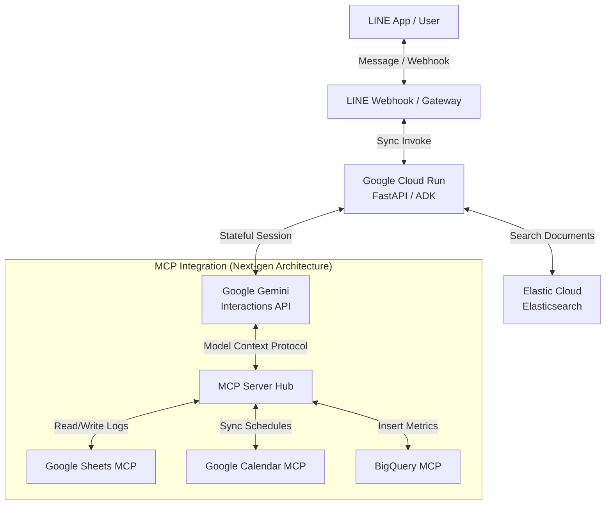
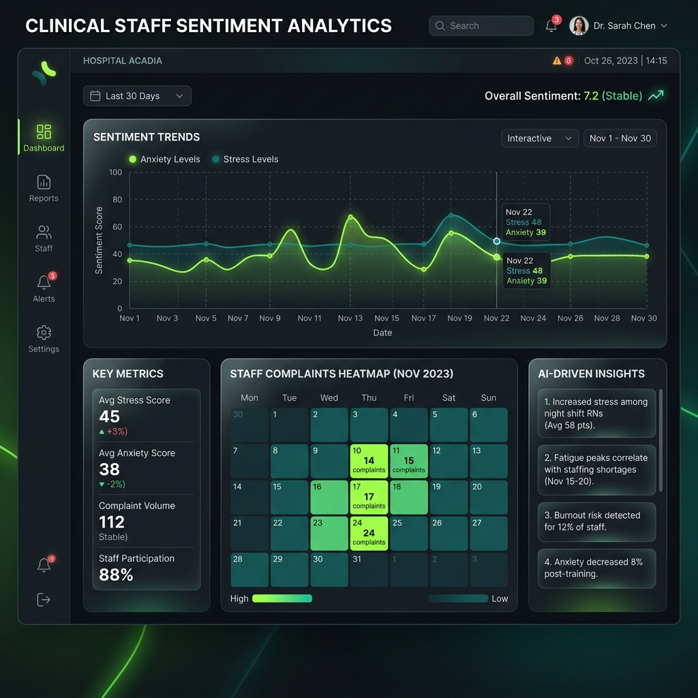
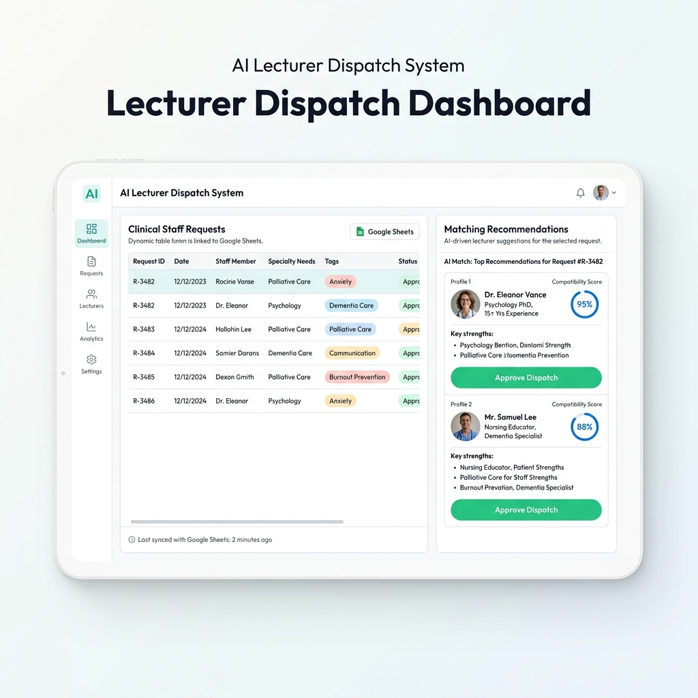

# awa-link-hackathon


Agent generated with `agents-cli` version `0.5.0`

## Project Structure

```
awa-link-hackathon/
├── app/         # Core agent code
│   ├── agent.py               # Main agent logic
│   ├── fast_api_app.py        # FastAPI Backend server
│   └── app_utils/             # App utilities and helpers
├── tests/                     # Unit, integration, and load tests
├── GEMINI.md                  # AI-assisted development guide
└── pyproject.toml             # Project dependencies
```

> 💡 **Tip:** Use [Gemini CLI](https://github.com/google-gemini/gemini-cli) for AI-assisted development - project context is pre-configured in `GEMINI.md`.

## Requirements

Before you begin, ensure you have:
- **uv**: Python package manager (used for all dependency management in this project) - [Install](https://docs.astral.sh/uv/getting-started/installation/) ([add packages](https://docs.astral.sh/uv/concepts/dependencies/) with `uv add <package>`)
- **agents-cli**: Agents CLI - Install with `uv tool install google-agents-cli`
- **Google Cloud SDK**: For GCP services - [Install](https://cloud.google.com/sdk/docs/install)


## Quick Start

Install `agents-cli` and its skills if not already installed:

```bash
uvx google-agents-cli setup
```

Install required packages:

```bash
agents-cli install
```

Test the agent with a local web server:

```bash
agents-cli playground
```

You can also use features from the [ADK](https://adk.dev/) CLI with `uv run adk`.

## Commands

| Command              | Description                                                                                 |
| -------------------- | ------------------------------------------------------------------------------------------- |
| `agents-cli install` | Install dependencies using uv                                                         |
| `agents-cli playground` | Launch local development environment                                                  |
| `agents-cli lint`    | Run code quality checks                                                               |
| `agents-cli eval`    | Evaluate agent behavior (generate, grade, analyze, and more — see `agents-cli eval --help`) |
| `uv run pytest tests/unit tests/integration` | Run unit and integration tests                                                        |
| `agents-cli deploy`  | Deploy agent to Cloud Run                                                                   |

## 🛠️ Project Management

| Command | What It Does |
|---------|--------------|
| `agents-cli scaffold enhance` | Add CI/CD pipelines and Terraform infrastructure |
| `agents-cli infra cicd` | One-command setup of entire CI/CD pipeline + infrastructure |
| `agents-cli scaffold upgrade` | Auto-upgrade to latest version while preserving customizations |

---

## Development

Edit your agent logic in `app/agent.py` and test with `agents-cli playground` - it auto-reloads on save.

## Deployment

```bash
gcloud config set project <your-project-id>
agents-cli deploy
```

To add CI/CD and Terraform, run `agents-cli scaffold enhance`.
To set up your production infrastructure, run `agents-cli infra cicd`.

## Observability

Built-in telemetry exports to Cloud Trace, BigQuery, and Cloud Logging.

---

## 🚀 Next-Gen Architecture: Model Context Protocol (MCP) Integration

AWA-LINK Hackathon incorporates the industry-standard **Model Context Protocol (MCP)**, allowing the Gemini AI agent to interact seamlessly and securely with external services (such as Google Sheets, Google Calendar, and BigQuery) without writing boilerplate API integration code.

### Architecture Diagram



### Key Advantages of MCP
1. **No-Code Tool Expansion**: By using standard MCP servers (e.g., `google-sheets-mcp-server`, `google-calendar-mcp-server`), the agent can schedule events and log clinical session data natively without custom OAuth/API clients in the core backend.
2. **Encapsulated Security**: Credentials and permissions are locked inside the local/cloud MCP hosting layer, keeping the core AI Agent logic secure and compliant with enterprise standards.
3. **Plug-and-Play Extensibility**: Easily swap or add new MCP servers (e.g., Slack, GitHub, Postgres) in the future to expand the agent's capabilities instantly.

---

## 🎨 デモ画面イメージ（将来的な拡張構想）

ハッカソン発表で提示する、将来的な「えげつない価値」を示すUIモックアップイメージです。

### ① BigQueryを用いた、地域のスタッフの不満・不安の時系列解析ダッシュボード
LINE相談から得た感情ログをBigQueryで集計し、Looker StudioなどのBIツールでリアルタイム可視化したダッシュボード画面です。


### ② スプレッドシートと連動した「最適な講師の自動派遣提案」のAI管理画面
スタッフのSOS悩みに応じて、スプレッドシート上の講師リストから最適な候補者をマッチング度（%）と共に自動推薦する管理UIです。

